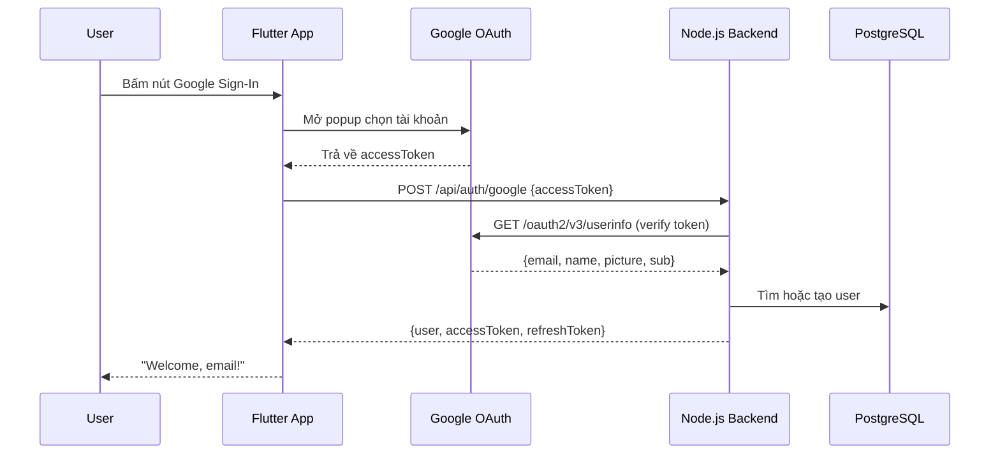

# Lucky Ly — Google Sign-In Setup Walkthrough

Hướng dẫn chi tiết để teammates pull code về và chạy được tính năng **Google Sign-In**.

---

## Yêu cầu cài đặt

| Tool | Version | Link |
|------|---------|------|
| **Node.js** | ≥ 18 | [nodejs.org](https://nodejs.org) |
| **Flutter** | ≥ 3.10 | [flutter.dev](https://flutter.dev) |
| **PostgreSQL** | ≥ 14 | [postgresql.org](https://www.postgresql.org) |
| **Git** | latest | [git-scm.com](https://git-scm.com) |

---

## Bước 1: Clone & Cài dependencies

```powershell
git clone <repository-url>
cd Lucky_Ly

# Backend
cd backend
npm install

# Flutter
cd lucky_ly_mobile
flutter pub get
```

---

## Bước 2: Tạo Database PostgreSQL

### 2.1 Tạo database
Mở **pgAdmin** hoặc **psql**, tạo database:
```sql
CREATE DATABASE lucky_ly;
```

### 2.2 Chạy SQL scripts (theo thứ tự)

```powershell
# Kết nối vào database lucky_ly, sau đó chạy lần lượt:
```

**Script 1** — Tạo bảng chính:
```
database/init_lucky_ly_postgres.sql
```

**Script 2** — Migration Google Auth (thêm cột `auth_provider`, `provider_uid`):
```
database/migration_add_google_auth.sql
```

> [!IMPORTANT]
> Phải chạy **đúng thứ tự**. Script 1 trước, Script 2 sau.

---

## Bước 3: Tạo file [.env](file:///d:/H%E1%BB%8Dc/CNPM/App_LucKy_Ly/Lucky_Ly/backend/.env) cho Backend

File [.env](file:///d:/H%E1%BB%8Dc/CNPM/App_LucKy_Ly/Lucky_Ly/backend/.env) **KHÔNG được push lên GitHub** (nằm trong [.gitignore](file:///d:/H%E1%BB%8Dc/CNPM/App_LucKy_Ly/Lucky_Ly/backend/.gitignore)). Mỗi người cần tự tạo.

Tạo file [backend/.env](file:///d:/H%E1%BB%8Dc/CNPM/App_LucKy_Ly/Lucky_Ly/backend/.env) với nội dung:

```env
NODE_ENV=development
PORT=4000

DB_HOST=localhost
DB_PORT=5432
DB_NAME=lucky_ly
DB_USER=postgres
DB_PASSWORD=<mật_khẩu_PostgreSQL_của_bạn>
DB_SSL=false

JWT_ACCESS_SECRET=my_super_secret_key_for_lucky_ly_app_2026
JWT_ACCESS_EXPIRES_IN=15m
REFRESH_TOKEN_TTL_DAYS=30

CORS_ORIGIN=*
BCRYPT_ROUNDS=12

GOOGLE_CLIENT_ID=301453242147-i7a769fga6fmvmbdghnguntvhfe87r1c.apps.googleusercontent.com
```

> [!CAUTION]
> Đổi `DB_PASSWORD` thành mật khẩu PostgreSQL thật của bạn!

---

## Bước 4: Chạy ứng dụng

Mở **2 terminal riêng biệt**:

### Terminal 1 — Backend
```powershell
cd d:\...\Lucky_Ly\backend
npm run dev
```
✅ Thành công khi thấy: `Auth API running on port 4000`

### Terminal 2 — Flutter Web
```powershell
cd d:\...\Lucky_Ly\backend\lucky_ly_mobile
flutter run -d web-server
```
Hoặc mở trên Chrome:
```powershell
flutter run -d chrome
```

---

## Bước 5: Test Google Sign-In

1. Mở URL Flutter web (ví dụ `http://localhost:55508`)
2. Bấm nút **📧** (icon lá thư đỏ) trong phần "Or continue with"
3. Chọn tài khoản Google
4. Nếu thành công → thanh xanh lá hiện: **"Welcome, [email]!"**

---

## Kiến trúc Google Sign-In



---

## Các file đã thay đổi

| File | Vai trò |
|------|---------|
| [main.dart](file:///d:/Học/CNPM/App_LucKy_Ly/Lucky_Ly/backend/lucky_ly_mobile/lib/main.dart) | Flutter: Firebase init + Google Sign-In flow |
| [index.html](file:///d:/Học/CNPM/App_LucKy_Ly/Lucky_Ly/backend/lucky_ly_mobile/web/index.html) | Firebase JS SDK + Google Sign-In meta tag |
| [auth.service.js](file:///d:/Học/CNPM/App_LucKy_Ly/Lucky_Ly/backend/src/modules/auth/auth.service.js) | Backend: verify Google token + tạo user |
| [auth.validation.js](file:///d:/Học/CNPM/App_LucKy_Ly/Lucky_Ly/backend/src/modules/auth/auth.validation.js) | Zod schema: chấp nhận idToken hoặc accessToken |
| [auth.controller.js](file:///d:/Học/CNPM/App_LucKy_Ly/Lucky_Ly/backend/src/modules/auth/auth.controller.js) | Controller: route handler cho `/api/auth/google` |
| [.env.example](file:///d:/Học/CNPM/App_LucKy_Ly/Lucky_Ly/backend/.env.example) | Template biến môi trường |
| [migration_add_google_auth.sql](file:///d:/Học/CNPM/App_LucKy_Ly/Lucky_Ly/database/migration_add_google_auth.sql) | SQL migration thêm cột Google auth |

---

## Troubleshooting

| Lỗi | Nguyên nhân | Cách fix |
|-----|------------|----------|
| `Missing required environment variable` | Thiếu file [.env](file:///d:/H%E1%BB%8Dc/CNPM/App_LucKy_Ly/Lucky_Ly/backend/.env) | Tạo file [.env](file:///d:/H%E1%BB%8Dc/CNPM/App_LucKy_Ly/Lucky_Ly/backend/.env) (Bước 3) |
| `connection refused` | PostgreSQL chưa chạy | Khởi động PostgreSQL service |
| `relation "users" does not exist` | Chưa chạy SQL scripts | Chạy SQL scripts (Bước 2) |
| `Internal server error` (Google login) | Chưa chạy migration SQL | Chạy [migration_add_google_auth.sql](file:///d:/H%E1%BB%8Dc/CNPM/App_LucKy_Ly/Lucky_Ly/database/migration_add_google_auth.sql) |
| `People API disabled` | Chưa bật API | [Bật People API](https://console.developers.google.com/apis/api/people.googleapis.com/overview?project=301453242147) |
| `CORS error` | Port Flutter khác `CORS_ORIGIN` | Set `CORS_ORIGIN=*` trong [.env](file:///d:/H%E1%BB%8Dc/CNPM/App_LucKy_Ly/Lucky_Ly/backend/.env) |
| Màn hình trắng trên web | Firebase chưa init cho web | Kiểm tra [index.html](file:///d:/H%E1%BB%8Dc/CNPM/App_LucKy_Ly/Lucky_Ly/backend/lucky_ly_mobile/web/index.html) có Firebase JS SDK |

---

## Google Cloud Console

Để chỉnh sửa cấu hình Google OAuth:
- **Project**: `lucky-ly` (ID: `301453242147`)
- **Credentials**: [console.cloud.google.com/apis/credentials](https://console.cloud.google.com/apis/credentials?project=lucky-ly)
- **OAuth Consent Screen**: [console.cloud.google.com/apis/credentials/consent](https://console.cloud.google.com/apis/credentials/consent?project=lucky-ly)
- **People API**: [Bật tại đây](https://console.developers.google.com/apis/api/people.googleapis.com/overview?project=301453242147)
