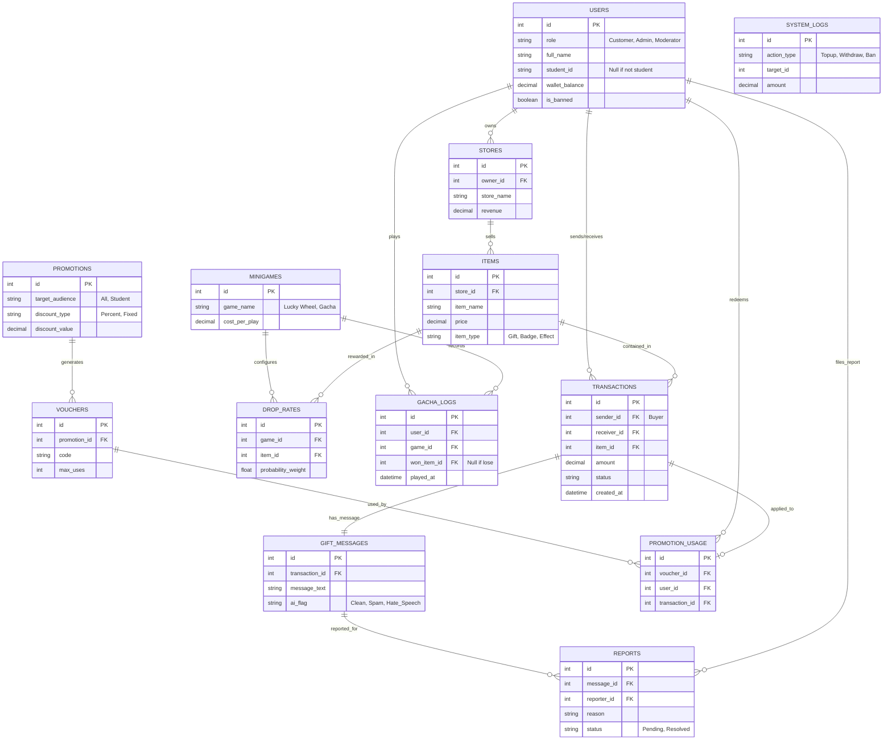

# Database Schema & ERD Dự án Lucky_Ly (Quà tặng ảo)

Sơ đồ ERD (Entity-Relationship Diagram) dưới đây mô tả cấu trúc liên kết dữ liệu giữa 6 Role trong hệ thống Quà tặng ảo.

## 📊 Sơ đồ Thực Thể Liên Kết (ERD)

## 🗃️ Cấu trúc bảng (Tables) theo từng Role

Dựa trên sơ đồ trên, đây là phân chia Database Tables cho từng bạn:

### 1. Nhóm Khách hàng (Customer)
- **`USERS`**: Lưu thông tin người dùng, số dư ví ($).
- **`TRANSACTIONS`**: Lưu lịch sử mua quà, tặng quà, liên kết ai tặng cho ai (`sender_id` tặng `receiver_id`).

### 2. Nhóm Cửa hàng (Store)
- **`STORES`**: Hồ sơ gian hàng.
- **`ITEMS`**: Danh sách quà tặng ảo cửa hàng đã tạo (màu sắc, mô tả, giá cả, thẻ tag). Tiền doanh thu sẽ đổ về gian hàng qua dữ liệu từ bảng mua bán.

### 3. Nhóm Quản trị viên (Admin)
- **`SYSTEM_LOGS`**: Lưu toàn bộ log nạp tiền vào ví, yêu cầu rút tiền từ ví ra tài khoản ngân hàng của Cửa hàng, và các action quản trị ban/mở khóa tài khoản.

### 4. Nhóm Quản lý Sự kiện / Minigame
- **`MINIGAMES`**: Danh sách sự kiện (Gacha hộp quà, Vòng quay).
- **`DROP_RATES`**: Tỷ lệ rớt đồ thuật toán sử dụng (Probability weight) cho từng món quà được cấu hình.
- **`GACHA_LOGS`**: Lịch sử tiêu ví chơi Gacha của user.

### 5. Nhóm CSKH / Kiểm duyệt (Moderator)
- **`GIFT_MESSAGES`**: Text lời chúc đính kèm trong hộp quà. Đã qua AI dán nhãn phân loại (`Clean`, `Spam`, `Hate_Speech`).
- **`REPORTS`**: Đơn tố cáo (Report) từ người dùng nếu ai đó cố tình tặng kèm quà xúc phạm hoặc lừa đảo.

### 6. Nhóm Quản lý Marketing / Khuyến mãi
- **`PROMOTIONS` & `VOUCHERS`**: Tạo chiến dịch và phát mã Code giảm giá. Set đối tượng cụ thể (Ví dụ hệ thống kiểm tra `student_id` có tồn tại thì mới cho dùng code).
- **`PROMOTION_USAGE`**: Theo dõi tiến độ hóa đơn nào đã sử dụng mã voucher nào, để tính ROI(lợi nhuận/chi phí) cho độ tuổi sinh viên.

---

> 🎉 Hoàn toàn dựa trên Schema này, nhóm có thể viết script Python (`Faker`, `SQLAlchemy`) tạo dữ liệu giả lập cho ứng dụng đủ 6 nghiệp vụ!
